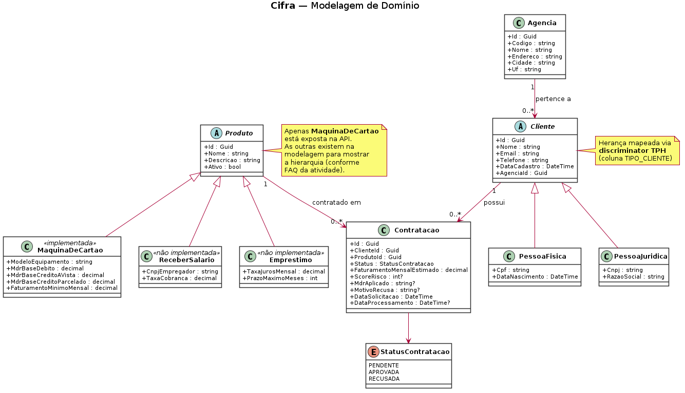
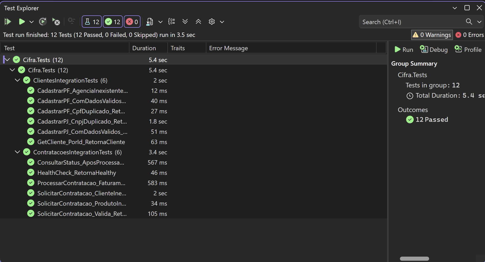
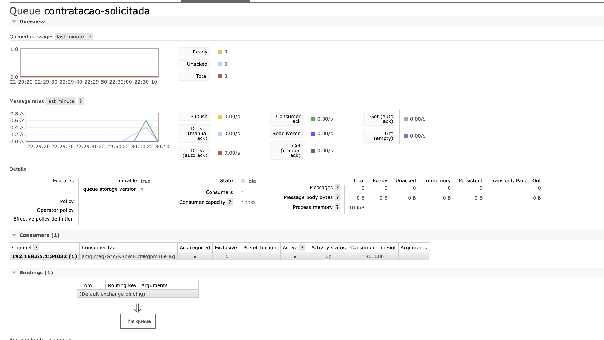
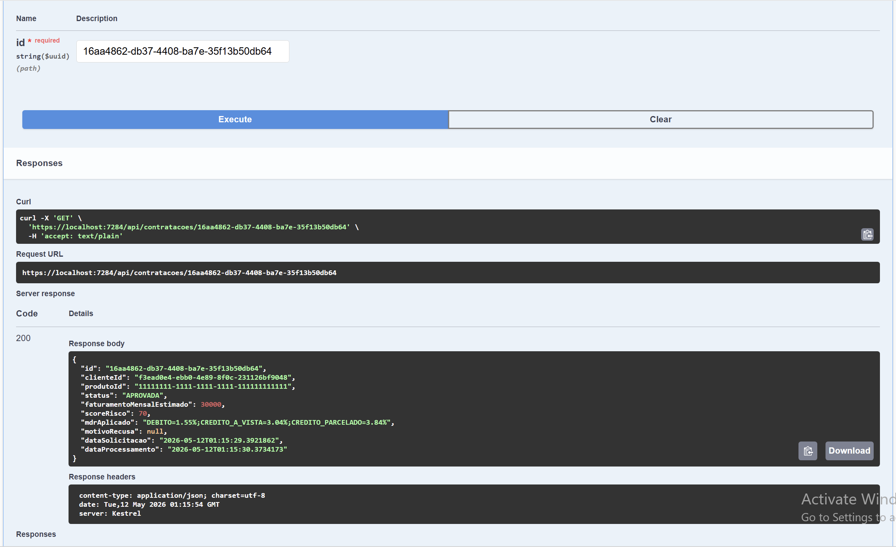

# Cifra — API com Mensageria

> **FIAP — Engenharia de Software (3ESR — 2026)**  
> Atividade Avaliativa — Prof. Rafael S. Novo Pereira  
> Stack: **.NET 8.0 · ASP.NET Core Web API · EF Core · Oracle FIAP · RabbitMQ · Serilog · OpenTelemetry · xUnit**

---

## 1. Identificação

| Nome completo | RM |
|---|---|
| Anna Beatriz de Araújo Bonfim | 559561 |

> Entrega **individual** (1 produto + Cliente PF/PJ + Agência + mensageria + testes).

---

## 2. Produto bancário escolhido

**Máquina de Cartão (`MaquinaDeCartao`).**

Justificativa:

- Encaixa na justificativa de mensageria do enunciado: "ativação de equipamento físico leva tempo, pode falhar e precisa ser reprocessada". É o caso mais didático para demonstrar `BasicNack(requeue: true)`.
- Tem regra de negócio real e demonstrável: cálculo de **MDR** (Merchant Discount Rate) variável por modalidade (débito, crédito à vista, crédito parcelado), com ajuste por **score de risco** baseado no faturamento mensal estimado.

Regras implementadas no `MaquinaDeCartaoProcessor`:

1. **Score de risco** — função sigmóide: `score = 100 × (1 − e^(−faturamento/25000))`. R$ 5k → ~50; R$ 30k → ~70; R$ 100k+ → ~98.
2. **Recusa por faturamento mínimo** — se `faturamentoEstimado < R$ 5.000`, recusa.
3. **Recusa por score** — se `score < 40`, recusa.
4. **MDR final por modalidade** — taxa base ajustada por `(75 − score) × 0,01`, com pisos de segurança.

---

## 3. Decisão de modelagem da fila

**Fila única `contratacao-solicitada` com discriminator `TipoProduto` no payload.**

| Opção | Prós | Contras |
|---|---|---|
| N filas (uma por produto) | Roteamento implícito | Mais infra, duplicação no startup |
| **Fila única + discriminator** ✅ | Menos objetos no broker, fácil escalar | Consumer "gordo" (mitigado pelo `switch` que delega para `IProcessor`) |
| Exchange topic | Flexível | Overkill para 1 produto |

Escolhi fila única com discriminator: adicionar `RECEBER_SALARIO` ou `EMPRESTIMO` no futuro é só um `case` novo no consumer + novo `IProcessor`, sem mexer em infraestrutura.

---

## 4. Diagrama de classes



Pontos da modelagem:

- `Cliente` é abstrata e mapeada como **TPH** (Table-Per-Hierarchy) no EF Core, com discriminator `TIPO_CLIENTE` ∈ {`PF`, `PJ`}.
- `Produto` também é abstrata, TPH com discriminator `TIPO_PRODUTO`. Só `MaquinaDeCartao` está exposta na API; `ReceberSalario` e `Emprestimo` aparecem no diagrama apenas (conforme FAQ do enunciado).
- `Cliente` pertence a uma única `Agencia` (1:N).
- `Cliente` possui N `Contratacao`.
- CPF e CNPJ têm índice único.

---
## 5. Como rodar localmente

### 5.1. Arquitetura

Esta entrega foi desenvolvida em arquitetura híbrida Mac + Windows VM (Parallels):

- 🍎 **Mac (host)**: Docker Desktop com RabbitMQ exposto em `5672` (AMQP) e `15672` (painel)
- 🪟 **Windows VM (Parallels)**: Visual Studio 2022 + API .NET + acesso ao Oracle FIAP via internet

A VM Windows acessa o RabbitMQ rodando no Mac via o IP do host na rede Parallels.

**Se você estiver replicando o projeto, ajuste o `RabbitMq.HostName` no `appsettings.json` conforme seu ambiente**:

| Ambiente | Valor de `HostName` |
|---|---|
| Mac + Windows VM no Parallels (modo Shared Network — padrão) | `10.211.55.2` (já configurado) |
| Windows direto (sem VM) com Docker Desktop no mesmo Windows | `localhost` |
| Linux/Mac com Docker rodando direto no host | `localhost` |
| Parallels em modo Bridged | IP da LAN do Mac (rodar `ifconfig en0` no Mac) |

Pra descobrir o IP correto se `10.211.55.2` não funcionar: no PowerShell da VM rode `ipconfig` e use o **"Gateway Padrão"** da interface Parallels.

### 5.2. Pré-requisitos

- .NET 8.0 SDK
- Docker Desktop
- Visual Studio 2022 (ou Rider / VS Code)
- Credenciais do Oracle FIAP (`oracle.fiap.com.br:1521/ORCL`)

### 5.3. Subir o RabbitMQ

No **Mac** (ou onde quer que rode o Docker):

```bash
docker compose up -d
```

Painel de gerenciamento: <http://localhost:15672> (login: `guest` / senha: `guest`).

### 5.4. Configurar Oracle FIAP

Edite `Cifra/appsettings.json` com suas credenciais Oracle FIAP:

```json
"OracleFiap": "User Id=rmXXXXXX;Password=SUA_SENHA;Data Source=oracle.fiap.com.br:1521/ORCL"
```

### 5.5. Aplicar migrations no Oracle

As migrations já estão versionadas em `Cifra/Migrations/`. Pra aplicar no seu schema:

```bash
cd Cifra
dotnet tool install --global dotnet-ef
dotnet ef database update
```

> ℹ️ **Se as migrations não estiverem no projeto** (deletadas, ou você está começando do zero), gera de novo antes:
> ```bash
> dotnet ef migrations add Initial
> dotnet ef database update
> ```

As tabelas criadas no schema têm prefixo `CIFRA_` (`CIFRA_CLIENTE`, `CIFRA_AGENCIA`, `CIFRA_PRODUTO`, `CIFRA_CONTRATACAO`) pra não conflitar com outras tabelas que você possa ter de outros projetos no mesmo schema FIAP.

### 5.6. Rodar a API

No Visual Studio: **F5**.

Via terminal:

```bash
dotnet run --project Cifra
```

- Swagger: <https://localhost:7xxx/swagger>
- Health: <https://localhost:7xxx/health>

Ao subir, o console deve mostrar duas linhas confirmando a conexão com RabbitMQ:
- `Conexão com RabbitMQ estabelecida em 10.211.55.2:5672` (publisher)
- `ContratacaoConsumer iniciado — escutando fila contratacao-solicitada`

### 5.7. Seed do produto Máquina de Cartão

Não há endpoint `POST /api/produtos` (catálogo é gerenciado pelo time interno do banco, não exposto via API). Insira o produto direto no Oracle SQL Developer (rodar uma vez):

```sql
INSERT INTO CIFRA_PRODUTO ("Id", "TIPO_PRODUTO", "Nome", "Descricao", "Ativo",
                           "MODELO_EQUIPAMENTO", "MDR_BASE_DEBITO",
                           "MDR_BASE_CREDITO_VISTA", "MDR_BASE_CREDITO_PARC",
                           "FATURAMENTO_MIN")
VALUES (HEXTORAW('11111111111111111111111111111111'),
        'MAQUINA_CARTAO', 'Maquininha Cifra', 'Maquininha padrão', 1,
        'CIFRA-POS-A8', 1.50, 2.99, 3.79, 5000.00);
COMMIT;
```

O ID do produto fica: `11111111-1111-1111-1111-111111111111` (GUID com bytes repetidos pra evitar conversão de byte order entre Oracle RAW(16) e .NET Guid).

---

## 6. Endpoints disponíveis

| Método | Rota | Descrição |
|---|---|---|
| POST | `/api/clientes/pf` | Cadastra pessoa física |
| POST | `/api/clientes/pj` | Cadastra pessoa jurídica |
| GET | `/api/clientes/{id}` | Busca cliente por id |
| POST | `/api/agencias` | Cadastra agência |
| GET | `/api/agencias/{id}` | Busca agência |
| POST | `/api/contratacoes` | Solicita contratação (publica na fila) |
| GET | `/api/contratacoes/{id}` | Consulta status da contratação |
| GET | `/health` | Health check da API + Oracle |

### Exemplo: criar agência

`POST /api/agencias`
```json
{
  "codigo": "0001",
  "nome": "Agência Paulista",
  "endereco": "Av. Paulista, 1000",
  "cidade": "São Paulo",
  "uf": "SP"
}
```

### Exemplo: criar PF

`POST /api/clientes/pf`
```json
{
  "nome": "Anna Beatriz",
  "email": "anna@example.com",
  "telefone": "11999999999",
  "cpf": "12345678901",
  "dataNascimento": "2002-05-01T00:00:00",
  "agenciaId": "{id-da-agencia}"
}
```

### Exemplo: solicitar contratação

`POST /api/contratacoes` → retorna **202 Accepted** com `status: "PENDENTE"`:

```json
{
  "clienteId": "{id-cliente}",
  "produtoId": "11111111-1111-1111-1111-111111111111",
  "faturamentoMensalEstimado": 30000
}
```

Após ~1 segundo, `GET /api/contratacoes/{id}` retorna `status: "APROVADA"` com `mdrAplicado`, `scoreRisco` e `dataProcessamento` preenchidos.

---

## 7. Como executar os testes

```bash
dotnet test
```

12 testes integrados, todos verdes — cobrindo:

- ✅ Cadastro PF e PJ válidos (`201`)
- ✅ CPF e CNPJ duplicados (`409`)
- ✅ Cadastro com agência inexistente (`404`)
- ✅ Consulta de cliente por id
- ✅ Contratação válida → `202` + Mock verifica que o publisher foi chamado 1× com payload correto
- ✅ Contratação com cliente/produto inexistente (`404`)
- ✅ Consulta de status após processamento → `APROVADA` com MDR e score
- ✅ Faturamento abaixo do mínimo → `RECUSADA` com motivo
- ✅ Health check (`200`)

Padrão técnico: `UseEnvironment("Testing")`, `ConfigureTestServices`, InMemory `"TestDb"` fixo, `AddDbContextCheck<AppDbContext>` envelopado em `if (!IsEnvironment("Testing"))`, `FindAsync` no lugar de `AnyAsync`.



---

## 8. Print do painel RabbitMQ com mensagens processadas



- Fila **`contratacao-solicitada`** ativa, **durável** (`D`)
- **Ack required** (manual ACK) habilitado
- 1 consumer (`cifra-consumer`) ativo com capacity 100%
- Picos no gráfico Message rates demonstrando publish/deliver/ack

---

## 9. Print da API rodando no Swagger com contratação aprovada



`GET /api/contratacoes/{id}` retornando:
- `status: "APROVADA"`
- `scoreRisco: 70`
- `mdrAplicado: "DEBITO=1.55%;CREDITO_A_VISTA=3.04%;CREDITO_PARCELADO=3.84%"`
- `dataProcessamento` preenchido (~1s após `dataSolicitacao`)
